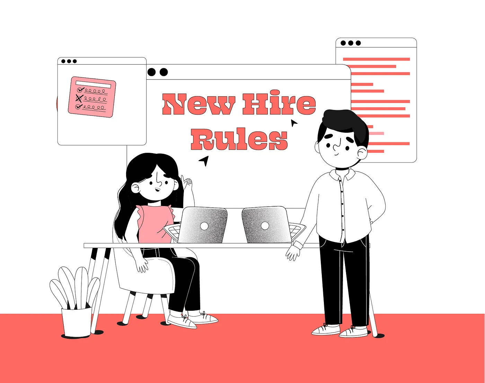
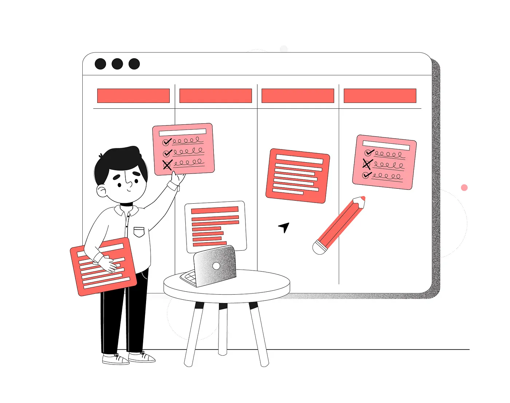

The other day I bit the hook on an alluring bait article about an outraged dad and a list of rules his 16-year-old daughter had received from her boss the first day on the job. Do tell!

Rule 1: Life is not fair — get used to it!

Rule 2: The world won’t care about your self-esteem. The world will expect you to accomplish something BEFORE you feel good about yourself.

Rule 3: You will NOT make $60,000 a year out of high school. You won’t be a vice-president with a car and a phone, and until you earn both.

Rule 4: If you think your teacher is tough, wait till you get a boss.

There are eleven in total, but you get the picture. Old school tough love pull yourself up by the bootstraps with a side dish of “I had to walk uphill both ways to school and so should you.”

The outrage comments ran the gamut from “Give a sad person little power and this happens!” and “You mean last day of work, right?,” to the more supportive “A lot of those things are true though,” and “Lol. Spot on truth for the most part. Many 16-year-olds need to hear this.”

Finally, my personal favorite:

“Um…. everyone knows that the boss didn’t write that list, right? I read it years ago on my grandma’s fridge.”

Given the general concepts in the list of rules, it seems you could sum these up to one rule:

This is a job and if you don’t like it, there’s the door. Not the best way to grow or keep talent imho.

The job referenced is most likely entry level. However, even if it’s flipping burgers at a fast-food burger chain, any corporate job has compliance training these days, even for entry level employees, to ensure that harassment-free and safe work environment conditions exist.

All of this got me thinking though: What rules or ideas do I normally impart to new hires as they join a design team? As a director during the “great resignation,” I have hired quite a lot of people. In the UX and Design field, it isn’t usually the first job for most individuals (unlike the 16-year-old), but many of them haven’t had a ton of jobs.

So, What would my list look like for a design team?

Here are a few that I think relate to the design/product world in which we live and breathe.

**1. Over prepare.**
We recently had Magic Johnson give a talk at our company. He said that being overly prepared is never a bad move. I had a presentation coming up a few days later. I did extra work, put extra slides in a deck, and I was glad that I did. It’s easy to get complacent and be overconfident. However, if you take the time to cover all your bases, you may not need it, and yet, the one time that you don’t do it is when you will regret it.

**2. Do the hard thing.**
What makes you uncomfortable? Do that. More often than not, the thing I procrastinate the most is the one that doesn’t always come naturally to me. But it is also usually the thing that I need to do the most, or at the very least, the one that will allow me to expand my skill set outside of my comfort zone.

**3. Trust your instincts.**
Everyone goofs up sometimes, so let go of regret and trust yourself and your skills. I’ve heard many teammates and friends allude to the “imposter syndrome”. More often than not, you are more awesome at your work than you give yourself credit, and building up that confidence comes only with putting yourself out there and trying.

**4. Take action.**
The counterbalance to procrastination or fear is action. Spend five minutes doing something, and it often turns into 15. Spend zero minutes doing something, and it stays at 0. Trick yourself into action if you must by taking a class, or telling yourself, “I’ll just do this one little thing to get going.” You’ll be amazed at the results if you start.

**5. Be kind.**
The old golden rule isn’t bad, “Treat others as you want to be treated.” But being kind to others and to yourself is even better. It’s a lighter, more emotionally informed approach. It’s amazing how much better it feels to give a compliment for a job well done than to point out a bunch of things that could have been done better. Try it.

**6. Get a mentor.**
I just read the quote, “You don’t have time to make all the mistakes, so learn from others,” by James Clear, author of Atomic Habits. I really like that. Never underestimate how helpful someone else’s experience can be towards easing your own challenges. Working with a mentor also means you both have an advocate when career opportunities come up, and you have someone to talk you off the ledge if the going gets tough.

**7. Seek Inspiration.**
Travel, look at art, read a book, listen to a new podcast. It’s easy to get stuck in a routine but a single spark can exponentially further your creativity and often your career. Have a challenging project? Try to find ways to solve it that are outside of your normal thinking. Sometimes there are limitations in design but strive to expand first, and be limited second.

P.S. Your mom doesn’t work here! But if she did, make her or another family proud by making the most of it. Life is short and feeling good about yourself and your work, no matter what it is, is not only within your control but most likely worth the effort.
