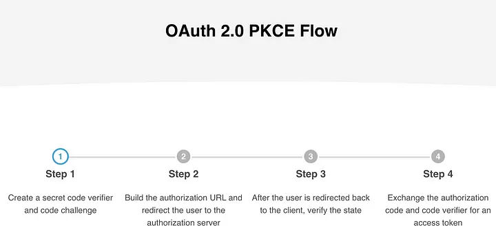

## Introduction
In the modern digital landscape, security is paramount, especially when dealing with third-party integrations that require authentication and authorization. OAuth 2.0 is widely adopted as a secure authorization framework, but traditional flows, such as the implicit flow, have proven vulnerable to security risks like token interception. To mitigate these risks, the [Proof Key for Code Exchange (PKCE)](https://datatracker.ietf.org/doc/html/rfc7636) extension was introduced, enhancing OAuth security by ensuring that authorization requests and token exchanges originate from the same client.

This article explores how [Omnissa Intelligence](https://techzone.omnissa.com/resource/what-omnissa-intelligence#where-to-learn-more) integrates with multiple External Partner services using **OAuth 2.0 with PKCE**, offering a secure authentication mechanism that prevents authorization code interception attacks.

## What is Omnissa Intelligence?
[Omnissa Intelligence](https://techzone.omnissa.com/resource/what-omnissa-intelligence#where-to-learn-more) is a **data-driven platform** that provides actionable insights across **end-user computing (EUC)** environments. It enables organizations to enhance **security, performance, and compliance** through intelligent automation, real-time analytics, and seamless integration with various enterprise solutions. By leveraging AI-driven insights, Omnissa Intelligence helps IT and security teams make **informed decisions** to optimize user experience and reduce operational risks. For more details, visit [Omnissa Intelligence](https://techzone.omnissa.com/resource/what-omnissa-intelligence#where-to-learn-more).

## What is PKCE?
PKCE (Proof Key for Code Exchange) is an enhancement to the OAuth 2.0 authorization framework, designed specifically for public clients such as mobile apps, browser-based applications, and other applications where client secrets cannot be securely stored. PKCE helps protect against authorization code interception attacks by introducing dynamically generated code challenge and code verifier parameters.

At a high level, this is an overview of how the flow appears.



### Key PKCE Parameters
* **Code Verifier:**  A cryptographically random string used to correlate the authorization request with the token request.
* **Code Challenge:** A transformation of the code verifier (e.g., SHA-256 hashed and Base64 URL encoded) sent in the authorization request.
* **Code Challenge Method:** Specifies the method used to derive the code challenge, typically `S256`.

## Why PKCE is Critical for External Partner Integrations
External Partner services mandate PKCE-based OAuth 2.0 integration for third-party applications such as Omnissa Intelligence to mitigate security threats. Traditional OAuth flows rely on client secrets, but public applications cannot store them securely. This introduces risks such as authorization code theft, allowing attackers to exchange stolen codes for access tokens, gaining unauthorized access to user data.

By enforcing OAuth PKCE, External Partner services ensure that only the original requesting client can exchange an authorization code for an access token. This security measure protects against session hijacking, token theft, and man-in-the-middle attacks.

## PKCE Flow Overview
The OAuth 2.0 PKCE flow for Omnissa Intelligence integrating with an External Partner follows these steps:


During the initial step (https://external-partner.com/oauth/authorize) of the OAuth procedure, the Omnissa Intelligence Authorization Server provides the `code_challenge` parameter to the External Partner Authorization Server.

After the user manually authorizes the application, the External Partner Authorization Server responds with an Authorization Code, which must then be returned to the External Partner Authorization Server along with the code_verifier parameter by the Omnissa Intelligence Authorization Server, in exchange for an Access Token.

If the `code_verifier` parameter does not match the `code_challenge` provided by Omnissa Intelligence Authorization Server in the initial authorization request, this may indicate an attempted code injection attack. In this case, the External Partner Authorization Server should abort the OAuth process and return an error.

If the External Partner Authorization Server verifies that the `code_challenge` and `code_verifier` match, the token exchange request is processed successfully, and the External Partner Authorization Server issues an Access Token via the token endpoint (https://external-partner.com/oauth/token).

##### Sample Requests:

Omnissa Intelligence redirects the user to the External Partner Authorization Server for authentication, including the Code Challenge in the request.

```
Authorization Request

https://partner-auth.com/oauth/authorize
   ?response_type=code
   &client_id=OMNISSA_INTEL_CLIENT_ID
   &redirect_uri=OMNISSA_INTEL_REDIRECT_URI
   &code_challenge=GENERATED_CODE_CHALLENGE
   &code_challenge_method=S256
   &state=RANDOM_STATE
   &scope=REQUESTED_SCOPES
```
The External Partner redirects the user back to the Omnissa Intelligence Authorization Server redirection endpoint with Authorization Code & State Parameter (to prevent CSRF attacks)

```
Redirect URL

https://omnissa-intelligence.com/oauth/callback
?code=AUTHORIZATION_CODE
&state=RANDOM_STATE
```

The Omnissa Intelligence Authorization Server sends a POST request to the External Partner Authorization Server, including Authorization Code, Code Verifier (original random string), Client ID & Redirect URI

```
Token Exchange(POST Request)

POST https://partner-auth.com/oauth/token
Content-Type: application/x-www-form-urlencoded
grant_type=authorization_code
&client_id=OMNISSA_INTEL_CLIENT_ID
&redirect_uri=OMNISSA_INTEL_REDIRECT_URI
&code=AUTHORIZATION_CODE
&code_verifier=ORIGINAL_CODE_VERIFIER
```

The External Partner Authorization Server validates: Authorization Code (to ensure it’s valid), Code Verifier (must match the previously hashed Code Challenge). If verification succeeds, the External Partner Authorization Server issues an Access Token & Refresh Token.

```
Token Response

{
"access_token": "ACCESS_TOKEN",
"token_type": "Bearer",
"refresh_token": "REFRESH_TOKEN",
"expires_in": 3600
}
```

## Conclusion
By implementing OAuth 2.0 with PKCE, Omnissa Intelligence ensures a secure, scalable, and compliant authentication flow when integrating with External Partner services. PKCE eliminates the need for client secrets, although in some cases, it is required with the Authorization Code. This helps reduce risks such as authorization code interception and token theft.

This standardized OAuth 2.0 PKCE flow provides a secure foundation for all future integrations, ensuring consistent authentication security across applications. Adopting PKCE enhances protection against evolving threats, making third-party integrations robust, reliable, and future-proof. For more details, visit Omnissa Intelligence.