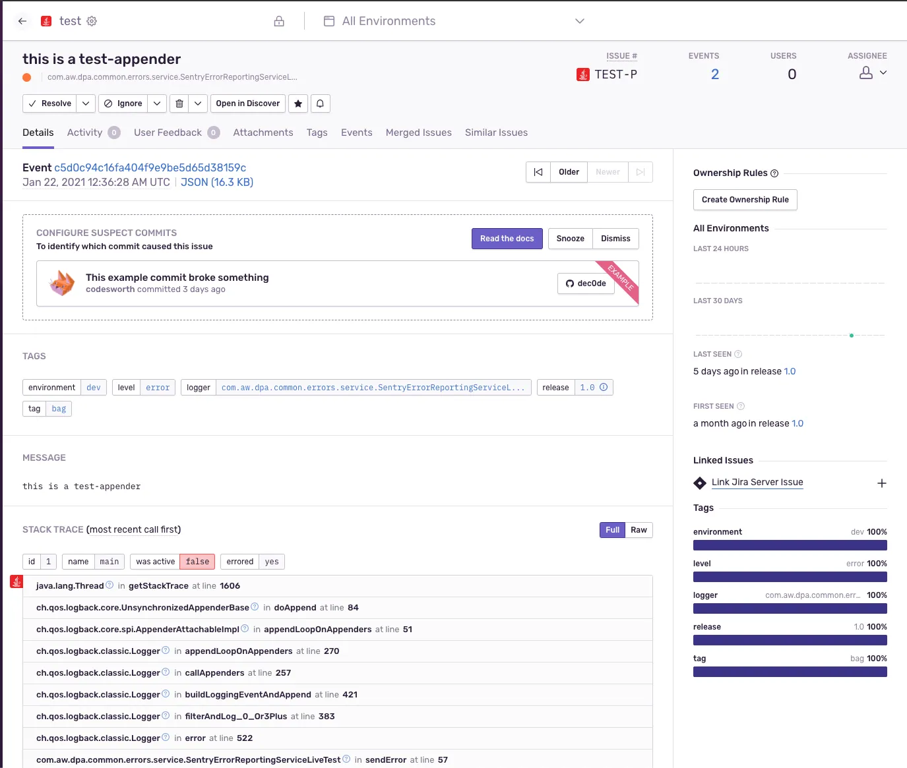
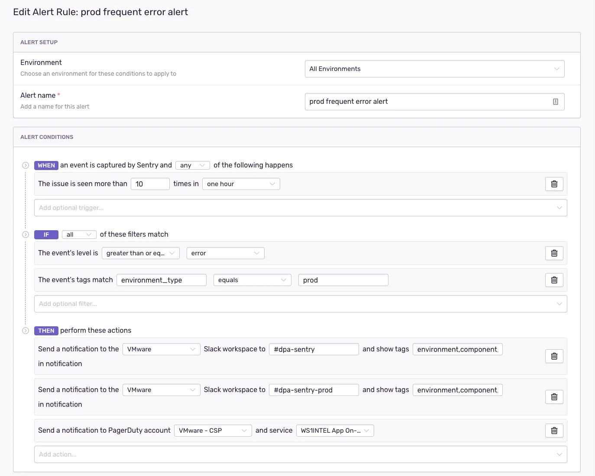
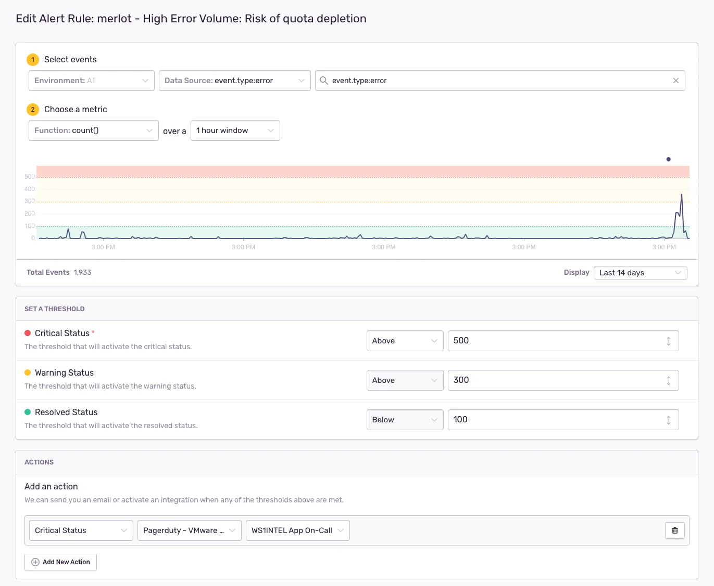

We don’t live in a perfect world, and software is no exception to that. Testing can’t always catch everything or anticipate every potential failure with third-party dependencies or services. Code reviewers and the engineers who wrote the code are susceptible to fatigue and human error. It is simply a fact that bugs and other errors are going to happen at some point.

Acknowledging this truth requires that we have feedback mechanisms in place to let us know when unexpected errors occur, so that we can quickly investigate and resolve issues before they impact our customers. It’s even better (and much less expensive) when issues are detected before they can even reach our customers.

This article tells the story of how the VMware Workspace ONE Intelligence team came to use [Sentry](https://sentry.io/welcome/) to help us maintain a high standard of reliability and quality for our services.

## Background
[Omnissa Workspace ONE Intelligence](https://www.omnissa.com/products/omnissa-intelligence/) is a SaaS-based data analytics platform comprised of 40+ container-based microservices and dozens of lambdas running on AWS. We have deployments in regions around the world and a highly distributed team. Our platform ingests a ton of data from a wide variety of sources — roughly 4 TB per day in our busiest deployment! All sorts of interesting problems can happen at this scale and we are regularly pushing the limits of AWS. As such it’s extremely important for us to have solid tools that help us be aware of and troubleshoot issues.

## Log Monitoring with SumoLogic
Logs from our services and other components are sent to SumoLogic, which allows us to search and analyze log data. Some of the logs that make their way into [SumoLogic](https://www.sumologic.com/) are log statements added to our code (or that third-party libraries have added to theirs) to highlight potential error conditions. These logs generally have a WARN or ERROR level depending on the potential severity of the application state. We can then run queries for such logs to find errors. Further, those same queries can be executed to run on a schedule and trigger alerts when a log count threshold is reached.

This log-based approach was used by our team for what we will call “Log Review” and “Log Monitoring.”

### Log Review

The purpose of Log Review was to find problems in staging before code is released to production. During each sprint an engineer was assigned to a Log Review rotation. This meant that the engineer needed to remember to run a handful of queries against logs in our staging environment at least once a day. Any issues found that required a fix or further investigation were created as bugs or tasks under a log review Epic in JIRA.

Log Review was problematic for a few reasons. Within a single sprint it was somewhat manageable for the assigned engineer to maintain context over which issues were new or previously triaged, but that context was easily lost when the next engineer came along. Some “tribal knowledge” was required in order to stay on top of things — which is not easy with a large and distributed team that continues to grow and develop microservices.

But perhaps the biggest problem was that it required a human remembering to go in to SumoLogic and manually run queries to hunt for issues while also staying on top of their other tasks. This meant that some issues were only detected whenever someone went to look for them, which could mean hours or days going by as more code is merged. Finding the needle in the hay stack representing the offending commit is much harder when the haystack keeps growing.

### Log Monitoring

Log monitoring was essentially an automated set of queries for WARN and ERROR logs that would trigger PagerDuty alerts when any results were found. The queries were run on an hourly basis. Filters were periodically added to these queries to avoid noise from known issues.

The team had some success with this approach. Because of the integration with PagerDuty, issues were generally quickly examined and triaged by the engineer on call. Filters were added if needed and the queries could be updated by our DevOps team to avoid continued noise.

This approach had some serious drawbacks, however. The biggest issue was that the queries spanned multiple services and components. When a PagerDuty incident was created, it was not scoped to a particular component or issue. This meant that new incidents would not be created when the queries ran again as long as there was already an incident already open for the failing query. If the engineer on call forgot to resolve the incident after triage, then it was possible to not be alerted on new errors!

Further, because the alerts spanned services, engineers didn’t immediately know where the problem was. Identifying the troubled system component(s) required running the SumoLogic query linked to the PagerDuty Incident, and visually scanning all of the results. Alerts only told the engineer “hey something is broken somewhere…go find it!”

Another issue was timeliness in detecting errors, purely based on the fact that the queries were run on an hourly basis. Oftentimes the offending logs were intermittent failures from some external service that were already resolved by the time we got the PagerDuty alert.

Finally, there was a lack of historical context for issues found in logs, for many of the same reasons we had this problem in Log Review. No release or commit information is associated with logs and there is no way to see the history of a log other than searching for the specific log or finding a ticket in JIRA. Context for issues discovered during an on-call rotation was lost as we rolled over to the next engineer. All of this added up in terms of engineering time and therefore cost.

## Goals To Improve
Log monitoring was helpful, but over time it was clear that we could do better. It was time-consuming, stressful, and prone to human error. In order to be really successful with error monitoring we needed a solution that would:

* Provide rapid feedback
* Provide more specific alerts 
* Provide enough context to troubleshoot problems quickly 
* Keep track of problems over time

## Error Monitoring With Sentry
Sentry at its core is an error aggregator for a wide variety of platforms and programming languages. When an application is integrated with the Sentry SDK, error events are sent to Sentry as they occur and grouped together based on traits like stack trace or message. The grouping of issues makes it much easier to digest problems and has the added benefit of tracking when an issue was first seen and last seen, how frequently it happens, and what environments it has been spotted in.

Error events can be generated in a number of ways - unhandled exceptions, failed HTTP requests in a web framework like Spring, or even “manually” in the code itself. What interested me the most though was the [logback integration](https://docs.sentry.io/platforms/java/guides/logback/), which is the logging framework we were already using in all of our applications. With this integration we could generate error events from ERROR or WARN log statements that already existed in our code.

You might be wondering why that’s any better than what we had with SumoLogic. The answer is: context! Sentry captures a lot of valuable information with each event. Some of those bits of information may include:

* HTTP request information — status code, URL, headers 
* Detailed stack traces 
* Thread information 
* Breadcrumbs — log statements preceding the error 
* Release number 
* Environment

It’s also possible to configure additional context and tags for events. We use the additional context to capture things like git commit, branch name, build number, and build job name. Tags, which are automatically searchable, are used to attach information like the AWS account or the team that owns a particular service.

All of this makes it much easier for engineers to troubleshoot and diagnose issues in our systems. We can rapidly identify what service a problem occurred in and when exactly that problem started. Further, we have context around the issue that is extremely helpful when debugging.

### Setting Up Projects

Sentry recommends creating a project for each code repository. Each one of our services maps to its own repository, so this was an easy fit. Because we had so many services already, we wrote a Ruby script that used the [sentry-api Gem](https://github.com/thierryxing/sentry-ruby-api) to provision projects for all services. This also makes provisioning projects for services in the future easier.

Part of provisioning a project is the generation of a DSN, which is a credential the Sentry SDK uses to send events for that project. A project can have multiple DSNs, but for now we only use one. This could be useful if you wanted to use a different DSN for each environment and control rate limiting, for example.

How you want to handle the DSN is up to you. It’s only good for publishing events, so it’s not extremely sensitive information and it can always be revoked and replaced. To be on the safe side, though, we store project DSNs as a secure string in the [AWS Systems Manager Parameter Store](https://docs.aws.amazon.com/systems-manager/latest/userguide/systems-manager-parameter-store.html). This happens in our provisioning script.

### Configuring Sentry

The Sentry SDK needs to be initialized with a DSN. This can happen automatically depending on your chosen integration, or with a call in your application bootstrapping code, which is as simple as:

```
// Retrieves DSN from your environment
// sentry.dsn system property or SENTRY_DSN environment variable
Sentry.init();

// Or you can supply it directly
Sentry.init("your-dsn-here");
```

Because our services run as containers on the [AWS Elastic Container Service](https://aws.amazon.com/ecs/?whats-new-cards.sort-by=item.additionalFields.postDateTime&whats-new-cards.sort-order=desc&ecs-blogs.sort-by=item.additionalFields.createdDate&ecs-blogs.sort-order=desc), we can use [ECS Secrets Manager](https://docs.aws.amazon.com/AmazonECS/latest/developerguide/specifying-sensitive-data-secrets.html) to automatically fetch the DSN from the parameter store and supply it to the container environment with the SENTRY_DSN environment variable.

Our lambdas unfortunately need to fetch the DSN from the parameter store themselves when they boot up, but this was fairly trivial for us to do.

### Getting Started With Logback Integration

Our code was already using the popular [logback framework](https://logback.qos.ch/) via [SLF4J](https://www.slf4j.org/). Sentry offers the sentry-logback module, which includes the [SentryAppender](https://github.com/getsentry/sentry-java/blob/main/sentry-logback/src/main/java/io/sentry/logback/SentryAppender.java) class. This can then be added to your logback configuration like any other appender and you are up and running! Configuration can be done programmatically or within your logback.xml file.

Our lambdas use the logback.xml file to add the appender:

```
<?xml version="1.0"?>
<configuration>
    <!-- See https://github.com/jlib-framework/jlib-awslambda-logback#configuration -->
    <appender name="awslambda" class="org.jlib.cloud.aws.lambda.logback.AwsLambdaAppender">
        <encoder>
            <charset>UTF-8</charset>
            <pattern>%d %-4relative [AWS request ID: %X{AWSRequestId:- }] [%level] %logger - %msg%n</pattern>
        </encoder>
    </appender>

    <!-- Configure the Sentry appender. -->
    <appender name="sentry" class="io.sentry.logback.SentryAppender">
        <options>
            <!--
                SentryAppender tries to initialize the Sentry SDK here and logs a
                WARN message unless the DSN is set to an empty string. We initialize the Sentry SDK
                ourselves after fetching the DSN from the AWS SSM parameter store.
            -->
            <dsn>${SENTRY_DSN:- }</dsn>
        </options>
        <minimumEventLevel>${SENTRY_LOG_LEVEL:-WARN}</minimumEventLevel>
    </appender>

    <root level="${LOG_LEVEL:-WARN}">
        <appender-ref ref="awslambda"/>
        <appender-ref ref="sentry"/>
    </root>
</configuration>
```

While our services take the programmatic approach within a Spring [InitializingBean](https://docs.spring.io/spring-framework/docs/current/javadoc-api/org/springframework/beans/factory/InitializingBean.html:

```
final SentryAppender sentryAppender = new SentryAppender();
sentryAppender.setContext(loggerContext);
sentryAppender.setMinimumEventLevel(Level.WARN);
sentryAppender.setName("sentryAppender");
sentryAppender.start();
final Logger logbackLogger = (ch.qos.logback.classic.Logger)LoggerFactory.getLogger("ROOT");
logbackLogger.addAppender(sentryAppender);
```

With this configuration, all of our services and lambdas send error events to Sentry whenever a log statement with level WARN or higher is reached.

```
log.error("this is a test-appender");
```




### Configuring Alerts

Now that errors are coming in we want to know about it. Sentry supports two types of alerts: Metric and Issue. Both types of alerts support triggering actions with one or more integrations. We have the Slack and PagerDuty integrations set up. Depending on the rules in the alert the team will see a message in a Slack channel and/or a PagerDuty alert will be sent to the engineer on call.

The Slack channel and configuration for the PagerDuty alert are based on an “environment_type” tag we apply to events. This helps us to reduce noise and prioritize based on where Issues are occurring. If something is breaking in prod, we want to be able to clearly see that. We do this by using a different Slack channel for prod and staging.



Issue alerts are centered around a single, specific Issue (grouped errors). We have alerts configured to let us know when:

* A new issue has been created 
* An issue is occurring frequently 
* A resolved issue is re-opened (seen again)

Because we want to route alerts based on “environment_type”, we have to create the same alerts for each type.



Metric alerts work based on counts across all issues within a project. Sentry billing works based on an event quota, and the alert pictured above is designed to make sure we are not caught off guard when we start seeing a high volume of events from any service in any environment. If the quota is reached, then Sentry could start to reject events.

### Handling Alerts

All engineers on the team can see alert activity in one or more Slack channels. PagerDuty alerts are also sent to an on-call engineer.

When an engineer looks at the issue they can assign it to themselves, create a JIRA ticket if one is not already linked, or add comments to let other engineers know what investigation they’ve done. Errors now have historical context!

## Evaluating Sentry Against Our Goals
### Provide rapid feedback

Alerts go to Slack and/or PagerDuty when they are triggered. We no longer wait up to an hour to be notified of issues. Also, instead of a single engineer receiving alerts, every member of the team can see activity in the Sentry Slack channel.

### Provide more specific alerts

Issue alerts let us know about a specific error in a specific service. The alert itself has the specific error in it. This means the on-call engineer can quickly glance at their phone and have some idea of where the problem is and how to prioritize it.

### Provide enough context to troubleshoot problems quickly

Sentry issues can provide a lot of useful context. We can see (scrubbed) request information, build/commit, history and we can add context ourselves where we need it. The build and historical information alone are invaluable in locating code that may have broken something.

### Keep track of problems over time

Sentry has removed the guesswork of determining whether an error is new or is known and already tracked. We know who has looked at the error and can see any activity or linked JIRA tickets. This represents a huge time savings for our engineers and cuts down on the “tribal knowledge” problem we had before.

## Conclusions
Sentry has been a great addition to our toolbox for monitoring and troubleshooting. We still need and use other tools like SumoLogic and CloudWatch, but it has become an excellent starting point for investigating issues both before and after deployment to production.

The main struggle we had was getting alerts configured for all of our projects. The API that the UI uses is not technically public so it made writing our script to create alerts a challenge. Scripting to manage Sentry configuration is needed, especially for larger organizations, because setting up every project manually is definitely not scalable or fun.