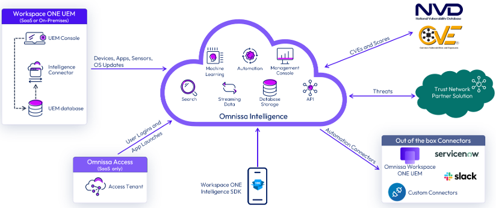

## What is Omnissa Intelligence?
Omnissa Intelligence is a cloud-native platform designed to unify and analyze telemetry across digital workspaces, providing actionable insights that drive efficiency, security, and user satisfaction. By aggregating data from various sources — including devices, applications, and user interactions — it enables organizations to monitor digital workspace metrics, proactively identify issues, and automate remediation processes.

* Aggregates and correlates data from multiple sources for actionable insights
* Leverage dashboards/reports/automations for optimized IT operations
* Enhance employee productivity and engagement by monitoring digital workspace metrics that impact user experience
* Leverage machine learning models to gain deep insights across your digital workspace

Built on a scalable architecture hosted on Amazon Web Services (AWS), Omnissa Intelligence leverages machine learning models to assess user risk scores based on activity and device context. This facilitates a zero-trust security approach, ensuring continuous verification and compliance across the enterprise.

The platform’s impact is evident across various industries. For instance, West Midlands Police utilized Omnissa Intelligence to enhance mobility and productivity for their officers, while Rentokil Initial successfully migrated 12,000 iOS devices to Workspace ONE in just three months, streamlining their operations

With a customer base spanning over 26,000 organizations worldwide, Omnissa Intelligence continues to be a trusted solution for enterprises seeking to optimize their digital work environments.

## Data Sources
Workspace ONE Intelligence receives and stores data from a number of sources

## Join Us at Omnissa Intelligence
If solving deep technical challenges like these excites you, we’re building the kind of team you’ll want to be a part of.

Omnissa Intelligence is actively hiring senior engineers who are passionate about distributed systems, security, observability, and cloud-native architecture. Whether it’s redesigning how modern authentication works at scale, securing data across global tenants, or rethinking how insights are delivered in real-time etc — these are the kinds of problems we tackle every day.

What makes this even more rewarding is the impact. The solutions we build aren’t just theoretical — they power real-world use cases for thousands of enterprises around the world, across industries like healthcare, finance, law enforcement, education, and retail. We’re a small, focused team inside a product with massive scale, and there’s still so much left to build.

If you’re someone who thrives on ownership, cares deeply about solving the right problems the right way, and wants to work with a humble, sharp team — we’d love to talk to you.

[Apply here to our open roles](https://www.linkedin.com/posts/activity-7307328157898919936-zHMp). Let’s shape what comes next, together.